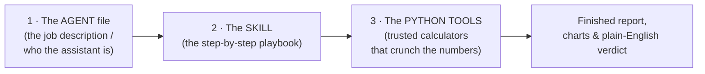

# PID Loop Health Assessor — How This Agent Works (A Plain-English Guide)

*A friendly, no-jargon explanation of what this project is and how this agent reads
control-system data and tells you whether an automatic control loop is healthy —
whatever that loop happens to control.*

This guide is written for a **non-technical reader**. You do not need to know
programming or control theory. Every technical word is explained the first time it
appears. If you only read one document in this project, read this one.

---

## Table of contents

- [PID Loop Health Assessor — How This Agent Works (A Plain-English Guide)](#pid-loop-health-assessor--how-this-agent-works-a-plain-english-guide)
  - [Table of contents](#table-of-contents)
  - [The 30-second version](#the-30-second-version)
  - [What problem does *this* agent solve?](#what-problem-does-this-agent-solve)
    - [The twist that makes this hard](#the-twist-that-makes-this-hard)
  - [The three pieces that make up this agent](#the-three-pieces-that-make-up-this-agent)
  - [How the agent thinks, step by step](#how-the-agent-thinks-step-by-step)
  - [Built to be general-purpose, not tied to one loop](#built-to-be-general-purpose-not-tied-to-one-loop)
  - [The key ideas in plain language](#the-key-ideas-in-plain-language)
    - ["Change-of-value" data (why the dots are so spread out)](#change-of-value-data-why-the-dots-are-so-spread-out)
    - [The "rolling window" (looking through a moving magnifying glass)](#the-rolling-window-looking-through-a-moving-magnifying-glass)
    - [Metrics (the agent's "senses")](#metrics-the-agents-senses)
    - [Fault signatures (matching the fingerprint to a diagnosis)](#fault-signatures-matching-the-fingerprint-to-a-diagnosis)
  - [The metrics, explained](#the-metrics-explained)
    - [First: the two things being measured](#first-the-two-things-being-measured)
    - [A quick word on "deadband" (ignoring the noise)](#a-quick-word-on-deadband-ignoring-the-noise)
    - [The basic measurements (the raw "senses")](#the-basic-measurements-the-raw-senses)
    - [The invented composite scores (fingerprints)](#the-invented-composite-scores-fingerprints)
    - [Putting it together — how the numbers name a fault](#putting-it-together--how-the-numbers-name-a-fault)
  - [The tools the agent uses](#the-tools-the-agent-uses)
  - [How do we know it actually works? Testing with known faults](#how-do-we-know-it-actually-works-testing-with-known-faults)
    - [The problem: real data has no answer key](#the-problem-real-data-has-no-answer-key)
    - [The fix: build a loop where we cause the faults on purpose](#the-fix-build-a-loop-where-we-cause-the-faults-on-purpose)
    - [The scoreboard](#the-scoreboard)
    - [The honest part](#the-honest-part)
    - [Where this lives, and what else you can use](#where-this-lives-and-what-else-you-can-use)
  - [How well does it perform? The scorecard so far](#how-well-does-it-perform-the-scorecard-so-far)
    - [1. The controlled simulation — grading the exact diagnosis](#1-the-controlled-simulation--grading-the-exact-diagnosis)
    - [2. An outside labelled dataset — grading the timing](#2-an-outside-labelled-dataset--grading-the-timing)
    - [Reading the score honestly](#reading-the-score-honestly)
  - [What you get at the end](#what-you-get-at-the-end)
  - [How you actually use it](#how-you-actually-use-it)
  - [Why build it this way?](#why-build-it-this-way)
  - [Honest limitations](#honest-limitations)
  - [Mini-glossary](#mini-glossary)
  - [Where to go next](#where-to-go-next)

---

## The 30-second version

Big buildings (and factories, and ships, and breweries) run on automatic controllers
that hold something steady — a temperature, a pressure, a flow. Sometimes a controller
misbehaves: it overshoots, hunts back and forth, or gets "stuck." This project is a
**general-purpose AI assistant that reads a controller's recorded data and diagnoses
what's wrong**, the same way an experienced technician would by eyeballing a chart —
except it does it automatically, explains its reasoning, and produces a tidy report.

It is **not tied to any one kind of loop.** Point it at an economizer, a chilled-water
valve, a face/bypass damper, or any other PID-controlled loop, and it applies the same
diagnostic method. It does this by pairing a smart AI assistant with a written
**playbook** and a set of **reliable math tools**, so the answers are consistent and
reproducible instead of guessed.

---

## What problem does *this* agent solve?

Automatic systems hold a value steady using a device called a **PID controller**. You
don't need the acronym — just picture the **cruise control in a car**. Cruise control
constantly nudges the accelerator to hold your chosen speed: ease off going downhill,
press harder going uphill. A PID controller does the same for a process, nudging a
valve, a damper, a pump, or a heater to hold a **target** value.

The thing being held steady can be almost anything — a room's temperature, the air
coming off a cooling coil, a duct pressure, a water flow. **This agent doesn't care
which**; the tell-tale signs of a badly behaving loop look the same across all of them.

When cruise control is tuned badly, you feel it: the car surges and slows, surges and
slows. Controllers have the same failure modes, and they waste energy, wear out
equipment, and make conditions uncomfortable or unstable. Common problems this agent
looks for — in *any* loop:

- **Hunting / oscillation** — the controller constantly overshoots and corrects, like a
  car that keeps speeding up and slowing down instead of holding steady.
- **Saturation (stuck at a limit)** — the controller is pushing as hard as it possibly
  can (fully open or fully closed) and *still* can't reach the target, so it sits pinned
  at that limit.
- **Integral windup** — the controller "over-commits" while it's maxed out, then
  overshoots dramatically when conditions finally change. (There is a detailed,
  friendly integral-windup walkthrough in the full project repository.)
- **Too aggressive (P too high)** — it reacts so hard to small changes that it creates
  fast, jittery back-and-forth motion.
- **Handoff chatter** — in loops where one signal drives *two* devices in sequence (like
  a face damper and a bypass damper), both can end up fidgeting at the crossover point.

The agent reads the building's own recorded data and figures out **which** of these is
happening, **when**, and **how often** — then writes it up in plain English.

### The twist that makes this hard

Normally, to judge a controller you compare two things: the **target** value and the
**actual** value. But in real exports the target is **often missing** — it simply wasn't
recorded. It's like being asked "was the driver holding their speed well?" when you can
only see how the car moved — not what speed they were *aiming* for.

So the agent's core skill is judging health purely from the **shape** of the wiggles in
the data — exactly the way a veteran technician can glance at a chart and say "that's
overshooting" without needing the target line. This shape-based method is what makes the
agent **general-purpose**: it works on any loop, with or without a recorded target.
Teaching an AI to do that reliably is the clever part.

---

## The three pieces that make up this agent

**1. The agent file** — a short document that tells the AI *who to be*: "You are an
HVAC (heating, ventilation & air conditioning) commissioning engineer who diagnoses
control loops." It sets the personality, the rules it must follow, and points to the
playbook. *(File: `.github/agents/pid-loop-assessment.agent.md`.)*

**2. The skill (the playbook)** — the detailed, written-down procedure: how to read the
data, which measurements to take, what each warning sign means, and how to write the
report. This is the project's expert knowledge, captured on paper so the AI follows it
the same careful way every single time. *(Folder: `.github/skills/pid-loop-assessment/`.)*

**3. The Python tools** — small, tested programs that do the actual number-crunching:
reading the data files, measuring the wiggles, scoring each time window, and generating
the charts and report. Because these are fixed, tested programs, the math is always
correct and **anyone can re-run them and get the identical answer**. The project ships a
shared toolbox of these building blocks, plus one tailored analysis per loop it has
studied so far — for example `analyze_pid_5min_loop.py` (an economizer) and
`analyze_pid_supply_air.py` (a split-range face/bypass loop). Faced with a *new* loop,
the agent writes a new tailored program in the same style rather than hand-editing an
old one.

> **Why separate the "thinking" from the "math"?** The AI is great at judgment,
> explanation, and deciding *what* to do — but you don't want it doing critical
> arithmetic freehand. By handing the arithmetic to fixed, tested tools, every number in
> the report is trustworthy and repeatable. The AI conducts the orchestra; the tools play
> the exact notes.

---

## How the agent thinks, step by step

When you ask the agent to assess a loop, here's what happens behind the scenes — told as
a story:

1. **It reads the playbook first.** Before touching your data, it opens the skill and
   the field guide so it follows the proven procedure rather than improvising.

2. **It opens the two data files.** One file is the **value the process actually
  reached** over time; the other is **how hard the controller was pushing** (a number
  from 0% = off to 100% = flat out), also over time.

3. **It reconstructs the full picture.** The data uses a space-efficient format: a new
  value is only saved *when something changes* (this is called **change-of-value**, or
  COV, logging). Between saved points, the value simply stays the same. The agent
  "fills in the gaps" so it has a continuous line to analyze instead of scattered dots.
   *(See [the data explained](#the-key-ideas-in-plain-language) below.)*

4. **It focuses on the parts that matter.** Stretches where the controller is pinned at
   a limit with nothing moving carry little information; the agent concentrates on the
   **active** periods where the controller is actually working, and flags the pinned
   stretches separately.

5. **It slides a "magnifying glass" across the timeline.** Rather than judging hours of
   data all at once, it examines a **short window at a time** (for example, 5 minutes),
   then slides that window forward a little and looks again — over and over. This is
   called a **rolling window**, and it's how it catches problems that come and go.

6. **It measures the shape of the wiggles in each window.** For every window it
   calculates things like: How big is the swing? How many times did it change direction?
   How long did it sit pinned at maximum? These measurements are its "senses."

7. **It names the problem in each window.** Using the playbook's rules, it labels each
   window: *healthy*, *integral windup*, *too aggressive*, *reacting to an outside
   disturbance*, and so on.

8. **It groups the findings into episodes.** If the same problem shows up in ten windows
   in a row, that's one **episode**, not ten separate alarms. This keeps the report
   readable.

9. **It writes the verdict and builds the report.** Finally it produces a plain-English
   summary ("the loop is mostly healthy but shows integral windup 18% of the time"),
   color-coded tables, and charts — and checks its own work before handing it to you.

Throughout, it keeps a little **to-do list** so it doesn't lose track of the multi-step
job — just like a person ticking off tasks.

---

## Built to be general-purpose, not tied to one loop

The goal of this project is **not** to analyze one specific air handler — it's to be a
reusable **PID loop assessor** that can be pointed at many different loops. The specifics
of a loop change; the diagnostic method doesn't.

What stays the same for every loop:

- the **shape-based** way of reading the data (works with or without a recorded target);
- the **rolling-window** scan that says *when* a problem happens, not just *whether*;
- the shared **metric toolbox** and **fault catalog** (hunting, windup, over-aggressive,
  disturbance, saturation, …);
- the **deliverables** — a plain-English verdict, a color-coded report, charts, and
  spreadsheets.

What changes from loop to loop is captured in a small, per-loop program:

- **what the signals mean** (which file is the measurement, which is the command);
- **how the command maps to hardware** — a simple valve is just 0–100%, but a
  *split-range* loop uses one signal to drive **two** devices in sequence (e.g. 0–50%
  strokes a face damper while a bypass stays open, and 50–100% strokes the bypass);
- **which fault signatures are worth checking** for that loop (a split-range loop adds a
  "handoff chatter" check a single valve never needs).

The project already includes two worked examples that prove the point — a cooling
**economizer** and a **face/bypass split-range** supply-air loop — both diagnosed with
the same playbook and toolbox, each with its own report and notebook. Adding a third kind
of loop follows the same recipe.

---

## The key ideas in plain language

A few concepts come up repeatedly. Here they are without the jargon.

### "Change-of-value" data (why the dots are so spread out)

Instead of recording the temperature every second, the building only records a **new
reading when the value actually changes** — to save storage space. Imagine a diary that
only gets an entry on days something interesting happened; on all the other days, you
assume things stayed the same as the last entry.

That's efficient, but it means the raw data looks like scattered dots. Before analyzing,
the agent connects those dots into a proper line by "holding" each value until the next
one appears. This step is essential — skip it, and the measurements come out wrong.

### The "rolling window" (looking through a moving magnifying glass)

Judging a whole day of data at once would blur brief problems into the average. So the
agent looks at a small slice of time, scores it, then shifts the slice forward and scores
again — marching across the whole timeline. This is how it can say *when* a problem
happened, not just *whether* it happened.

### Metrics (the agent's "senses")

A **metric** is just a number that measures one specific thing about the data — like
"how big was the temperature swing" or "how many times did it change direction." On
their own each is simple; combined, they let the agent recognize a problem's
**fingerprint**. This project even **invents a few new metrics** (with friendly names
like the *Hunting Index* and *Windup Index*) that bundle several measurements into a
single, telling score.

### Fault signatures (matching the fingerprint to a diagnosis)

Each type of controller problem leaves a distinctive **fingerprint** in the wiggles. A
slow, giant, one-directional swing points to *windup*; fast, tiny, back-and-forth jitter
points to *over-aggressive tuning*. The playbook lists these fingerprints, and the agent
matches what it measured against the catalog — exactly like a doctor matching symptoms to
a diagnosis.

---

## The metrics, explained

A **metric** is a single number that measures one feature of the wiggles. No single
number is a diagnosis on its own — the agent reads the *combination*, the way a doctor
reads several vital signs together. This section explains each one properly.

### First: the two things being measured

Every metric is computed on one of **two traces** over time:

- **The measurement** (the "PV" — process variable): what the loop is trying to hold
  steady, such as the supply-air temperature. This is the *result*.
- **The command**: how hard the controller is pushing, from 0% (off / fully one way) to
  100% (flat out / fully the other way). This is the *effort*.

Watching **both** is the whole trick. A calm measurement with a thrashing command is an
early warning; a wild measurement with a pinned command is a different story entirely.
Some metrics look at the measurement, some at the command, and the composite scores below
combine the two.

### A quick word on "deadband" (ignoring the noise)

Real sensors jitter by tiny amounts even when nothing is happening. If the agent counted
every micro-wiggle it would see "oscillation" everywhere. So each metric uses a
**deadband** — a small threshold (roughly half a degree for temperature, about one
percent for the command) *below which a wiggle is treated as zero*. Only movements bigger
than the deadband count. This is why the agent doesn't cry wolf over sensor noise.

### The basic measurements (the raw "senses")

| Plain name | What it measures | A high value hints at… |
|---|---|---|
| **Swing size** | How far the measured value moved from its lowest to its highest point in the window | a big disturbance or a big overshoot |
| **Restlessness** | The total up-and-down distance travelled — like a car's odometer | a fidgety loop that never settles |
| **Direction changes** | How many times the value turned around | many = fast oscillation; few = slow drift |
| **Oscillation period** | If it is genuinely cycling, how long one full cycle takes | a rhythm that points to a specific tuning fault |
| **Lopsidedness** | Whether the wiggle is a slow ramp then a fast drop (asymmetric) | a loop that keeps "winding up" |
| **Time against the limit** | How much of the window the command sat pinned fully open or fully closed | windup, or simply running out of capacity |
| **Handoff crossings** *(split-range loops only)* | How often the command crossed the point where control hands off from one device to another (e.g. 50%) | two devices thrashing at once |

**In more depth — what each one really means:**

- **Swing size (amplitude).** The simplest one: the highest value minus the lowest value
  in the window. If the temperature wandered between 72°F and 78°F over five minutes, the
  swing size is **6°F**. It tells you *how big* the movement was — but not whether it was
  one clean move or lots of jitter. That's why it's never used alone.

- **Restlessness (total travel).** Add up every up-and-down step, ignoring direction —
  like a car's odometer versus the straight-line distance home. A value that went
  72 → 75 → 73 → 76 travelled 3 + 2 + 3 = **8 units**, even though it only ended 4 above
  where it started. High travel with a *small* swing size means the loop is fidgeting in
  place; high travel with a *large* swing means big genuine excursions.

- **Direction changes (reversals).** How many times the trace turned around (each turn
  bigger than the deadband). In the 72 → 75 → 73 → 76 example there are **two**
  turnarounds. This is the agent's frequency sense: *many* reversals = fast, tight
  oscillation; *few* = a slow, one-way drift. It is the single most important clue for
  telling windup apart from over-aggressive tuning.

- **Oscillation period (rhythm).** *Only* calculated when the movement is genuinely
  cyclic — the agent requires the value to cross its own average line at least **three
  times** before it believes a rhythm is real (two crossings can happen by accident). If
  it crossed six times in a five-minute window, that's about three full cycles, or a
  period of roughly **1.7 minutes per cycle**. A short period points at proportional
  gain; a long, lazy period points at the integral term.

- **Lopsidedness (sawtooth skew).** Compares the *shape* of the climbs to the drops. A
  smooth, symmetric wave is balanced. A **shark-fin** shape — a slow ramp up followed by
  a sudden drop (or vice versa) — is lopsided, and that asymmetry is the classic tell of
  a loop that slowly "winds up" and then snaps back.

- **Time against the limit (rail dwell).** The fraction of the window the command spent
  pinned near a limit — fully open or fully closed. If the command sat at/near 100% for
  four of five minutes, that's **80%**. Sitting against a limit is normal briefly, but
  *long* dwell while the measurement is still drifting is the setup for windup, or a sign
  the equipment simply can't keep up (it has run out of capacity).

- **Handoff crossings (split-range only).** Counts how many times the command crossed the
  point where control hands from one device to the next — 50% for a face/bypass damper
  pair. A command that went 45 → 55 → 48 → 52 crossed the 50% line **three** times, which
  means *both* devices were stroking at once. A plain single valve never has this metric.

### The invented composite scores (fingerprints)

Textbook metrics usually assume you have the target line to compare against. With only
the *shape* to go on, this project combines the basic measurements above into a few new
scores, each tuned to capture one fault's fingerprint:

| Score | What it bundles together | It runs high when… |
|---|---|---|
| **Hunting Index** | direction changes × swing size | the loop oscillates both *often* and *widely* |
| **Aggression Index** | command direction changes × command range | the controller is thrashing its output hard |
| **Windup Index** | time-against-the-limit × swing size (weighted up when direction changes are few) | you see the classic "pinned at the limit, then one big slow swing" windup shape |
| **Crossover Thrash Index** *(split-range)* | handoff crossings × command range | the handoff point itself is hunting |
| **Loop lag** | the delay between the controller pushing and the measurement responding | (not a fault score) it tells the agent how sluggish the system is |

**Why bundle them? — the composite scores in more depth:**

- **Hunting Index = direction changes × swing size.** Either ingredient alone is
  misleading. Ten tiny reversals of a 0.2° wiggle is just noise; one giant 6° swing with
  no reversals is a disturbance, not hunting. *Real* hunting needs **both** frequency and
  size, so multiplying them gives one honest number that only lights up for genuine
  oscillation.

- **Aggression Index = command reversals × command range.** This one watches the *effort*
  side, not the result. A controller can be furiously sawing its command back and forth
  while the measurement still looks calm — an early warning that the proportional gain is
  set too high and the loop is working far harder than it should.

- **Windup Index = rail dwell × swing size, weighted for slowness.** This is the star
  detector. It's built to fire on one specific shape: the command **pinned against a
  limit** *and* a **big** swing in the measurement *and* — crucially — **few** direction
  changes (a slow turnaround). The "weighted for slowness" part means a fast, jittery
  swing is deliberately *down-weighted*, because fast jitter is P-too-high, not windup.
  So the same swing size scores as windup when it turns slowly and as something else when
  it turns fast.

- **Crossover Thrash Index = handoff crossings × command range** *(split-range)*. Ranks
  the windows where the handoff point itself is hunting — both dampers/valves cycling at
  once. This flags actuator wear that a single-device loop simply cannot produce.

- **Loop lag** — not a fault score, but the ruler everything else is judged against. The
  agent slides the command trace and the measurement trace past each other in time until
  the command's moves best line up with the measurement's *later* moves; that offset is
  the lag. It matters because tuning that is perfect on a fast loop is dangerously
  aggressive on a slow, laggy one — the lag sets what "good" even means for this loop.

### Putting it together — how the numbers name a fault

The power is in the *combination*. The same big swing size means completely different
things depending on the other metrics:

| The fingerprint | Swing size | Direction changes | Command | Verdict |
|---|---|---|---|---|
| Pinned at limit, one big slow swing | large | **few** | stuck against a rail | **Integral windup** |
| Fast, tight, symmetric jitter | large | **many** (short period) | thrashing | **P too high** |
| One big move, then settles | large | **very few** | *actively moving*, not pinned | **Disturbance** (not a fault) |
| Barely moving | small | few | calm | **Calm / healthy** |

Notice rows 1 and 3 have the *same* swing size and few direction changes — what separates
them is the **command**: windup keeps the command jammed against a limit, while a
disturbance shows the command actively chasing the change. That is exactly why the agent
insists on reading the measurement and the command *together* rather than trusting any
one metric.

The full technical definitions live in the playbook's **metric glossary**; this section
is the plain-English version.

---

## The tools the agent uses

Remember the difference between a chatbot (words only) and an agent (words **plus
actions**). Those actions are called **tools** — the specific things the agent is allowed
to do to get the job done. It reaches for a different one at each step of the story
above:

| Tool (capability) | What the agent does with it |
|---|---|
| **Read** | Open and read the playbook, the field guide, and your data files. |
| **Search** | Hunt through the project to find the right file, a reusable helper, or an earlier analysis. |
| **Edit / create files** | Write the tailored analysis program, the notebook, and the report. |
| **Run (execute)** | Actually *run* the program and the notebook to produce real numbers and charts — never guessed ones. |
| **Task list** | Keep a running checklist so a multi-step job doesn't drop a step. |
| **Notebook tools** | Open, edit, and run the interactive notebook cell by cell. |
| **Browser tools** | Optionally open the finished report in a web browser to confirm it looks right. |

The playbook tells the agent *which* tool to reach for at each step. The **Run** tool is
the crucial one: it is what lets the agent **check its own work against real data**
instead of merely asserting an answer — the single biggest reason to trust the numbers in
the report. The full list is in the playbook's **tools reference**.

---

## How do we know it actually works? Testing with known faults

Here's a fair question anyone should ask about a diagnostic tool: **how do we know it's
right?** A tool that confidently prints the wrong diagnosis is worse than no tool at all.

The honest answer is that you can't fully trust a diagnostician until you've watched them
work on cases where **you already know the answer** — like giving a trainee an eye chart
you can read yourself, or dipping a new thermometer in ice water to confirm it says 0°C.
That's exactly what we do here.

### The problem: real data has no answer key

The real building exports are honest but frustrating: nobody wrote down "the loop was
winding up between 2 and 3 p.m." So when the agent flags windup, there's no official
record to check it against. We *believe* the diagnosis from the shape of the data, but we
can't score it.

### The fix: build a loop where we cause the faults on purpose

So we create our own practice patient. On the computer we build a **pretend control
loop** — a simple simulated system with a controller nudging it, just like the real thing
— and then we deliberately break it in specific, known ways. We run it five times back to
back, each stretch carrying exactly one planted problem:

- a **healthy** stretch (nothing wrong — the agent should stay quiet);
- a stretch tuned **too aggressively**, so it jitters rapidly;
- a stretch that suffers **integral windup** (over-commits while maxed out, then
  overshoots);
- a stretch that **over-corrects slowly**, rolling past the target and back;
- a stretch hit by an **outside disturbance** (a sudden load change the loop must chase).

Crucially, we save all of this in the **exact same format as the real data**, and then we
hand it to the agent **without telling it where the planted faults are.** The agent
analyzes it blind, the same way it analyzes a real export.

### The scoreboard

Because *we* know what we planted, we can grade the agent automatically. For each stretch
we compare **what we caused** against **the agent's dominant verdict**, and tally how many
it got right — a simple report card. That scoreboard is the whole point: it turns "trust
me" into a number you can actually see.

Here is the current result. Analyzing the data **blind**, the agent correctly recovered
**all five** planted faults as the leading signature of their stretch:

| What we planted | What the agent decided (blind) | Right? |
|---|---|---|
| Healthy (calm) | Calm | ✓ |
| Too aggressive (fast jitter) | P too high | ✓ |
| Integral windup | Integral windup | ✓ |
| Slow over-correction | Too much integral | ✓ |
| Outside disturbance | Disturbance | ✓ |

### The honest part

That five-for-five did **not** happen on the first try, and the story is the real lesson.
The very first run scored only **2 out of 5** — the healthy and disturbance cases were
right, but the three dynamic faults all collapsed into "disturbance." The scoreboard
caught it immediately, and the cause turned out to be *our simulation, not the agent*: our
fake data was unrealistically smooth, so the tell-tale wiggles were too small for the
agent to register. Once we made the simulated loop record its data the way real equipment
does — in small discrete steps — and pushed each planted fault past its real threshold,
the score climbed to **5 out of 5**.

Two things are worth being honest about even so:

- **This was calibration, not luck.** The known answer key is exactly what exposed the
  smooth-data problem and told us how to fix it. Without it, we'd have shipped a tool that
  quietly mislabelled three faults out of five and never known.
- **The margins are still thin on the subtle cousins.** "Slow over-correction" and "too
  aggressive" are both oscillations; "windup" and a plain "disturbance" differ only in
  whether the command is jammed against its limit. So while the agent gets the *overall*
  verdict for each stretch right, individual short windows inside a stretch still
  occasionally land on the neighbouring fault. That's an inherent limit of judging by
  shape alone without a target line — and the benchmark makes it visible rather than
  hiding it.

### Where this lives, and what else you can use

The simulated test set and its scorecard live in their own separate **`Simulated
Benchmark/`** folder (generator `simulate_pid_benchmark.py`, grader
`analyze_pid_simulated.py`). You don't have to use *our* simulation, either — a second
harness in the **`Tennessee Eastman/`** folder (`load_tep.py` + `analyze_pid_external.py`)
grades the agent against an **outside, independently-labelled public dataset**, and the
same adapter accepts other labelled loop datasets from Kaggle and GitHub.

---

## How well does it perform? The scorecard so far

For a diagnostic tool, "performance" means two things: does it **catch the faults that are
really there**, and does it **stay quiet when nothing is wrong?** We measure both only on
data where the answer is already known. Two independent checks so far:

### 1. The controlled simulation — grading the exact diagnosis

Five stretches, one planted fault each, analysed blind. The agent named the correct fault
as the **leading verdict of all five** stretches:

| Planted fault | Agent's leading verdict (blind) | Result |
|---|---|---|
| Healthy | Calm | ✓ |
| Too aggressive | P too high | ✓ |
| Integral windup | Integral windup | ✓ |
| Slow over-correction | Too much integral | ✓ |
| Outside disturbance | Disturbance | ✓ |

**Score: 5/5.**

### 2. An outside labelled dataset — grading the timing

Using a public process-control benchmark (Tennessee Eastman) carrying a **sticking-valve**
fault, the agent stayed calm through the healthy baseline and raised a flag across the
whole faulty stretch — **2 / 2** labelled periods handled correctly — and the flag it
raised (*oscillation*) even matched the expected category.

### Reading the score honestly

- **Strong on clear-cut faults.** Big, distinct problems — violent oscillation, a command
  pinned at its limit, a healthy loop — are called correctly and confidently.
- **The subtle cousins are where it slips.** "Slow over-correction" versus "too
  aggressive," or "windup" versus a plain "disturbance," differ only by fine margins (how
  fast the value wiggles, whether the command is jammed against its limit). The *overall*
  verdict for each stretch is right, but individual short windows inside it still
  sometimes land on the neighbouring fault.
- **It errs toward flagging, not hiding.** Around the moment a fault begins, a few windows
  get flagged slightly early — a cautious bias that is far preferable to missing a real
  fault, but worth knowing.
- **These are known-answer tests, not a field trial.** The numbers above come from
  controlled data with a built-in answer key. They show the method is *sound*; they are
  not yet a large real-world validation, which would need many labelled real loops.

**Bottom line:** on data where we know the truth, the agent **catches every planted fault
and stays quiet on healthy stretches**, with its only real weakness being the fine line
between similar oscillation-type faults — the very boundary a human tuner also finds hard.

---

## What you get at the end

The agent doesn't just answer in the chat — it produces real, shareable files:

- **A plain-English verdict.** One or two paragraphs anyone can read: what's healthy,
  what's not, how often, and what to do about it.
- **A polished HTML report** you can open in any web browser — with color-coded tables,
  charts, and even the underlying calculations embedded so it's fully transparent.
- **Charts** that show the measured value and the controller's effort over time, with the
  problem periods highlighted.
- **Spreadsheet files (CSV)** listing every window and every episode, for anyone who
  wants to dig into the raw findings.
- **A Jupyter notebook** — an interactive document that mixes explanation, code, and
  results, so a technical colleague can re-run and verify everything.

Everything is **reproducible**: run it again on the same data and you get the same
answer, every time.

---

## How you actually use it

There are two ways, depending on who you are.

**If you just want the analysis (no technical setup):**
Open this project in **VS Code** (a free, popular code editor from Microsoft), open the
**Copilot Chat** panel, pick **"PID Loop Assessment"** from the agent menu, and type a
plain request such as:

> *"Assess how this loop is performing over 5-minute windows — check for hunting,
> integral windup, or over-aggressive tuning."*

The agent takes it from there and hands back the verdict and the report.

**If you're comfortable running a command:**
From the project folder, run a single command — `python run_analysis.py` — and it
produces the report, charts, and spreadsheets automatically. Each analyzed loop has its
own script in the same style (for example `python analyze_pid_supply_air.py` for the
split-range loop). *(Full setup instructions live in the full project repository.)*

---

## Why build it this way?

You might wonder: why the three-part structure instead of just asking a chatbot?

- **Consistency.** The written playbook means the agent does the analysis the same
  careful way every time, rather than improvising differently on each run.
- **Trustworthy numbers.** Handing the math to tested tools means the figures are
  reliable and reproducible — critical when someone's going to act on the diagnosis.
- **Transparency.** Every report shows its work; nothing is a mysterious black box.
- **Reusability.** The same playbook can guide the AI on new data or new questions
  without rebuilding anything.
- **Portability.** It runs on any modern computer with the free tools installed; it
  isn't locked to one machine.

In short: you get the **judgment and clear explanations of an AI** combined with the
**precision and repeatability of tested software** — the best of both.

---

## Honest limitations

Good diagnostics are honest about what they *can't* prove:

- **The target is often missing.** As explained earlier, the agent usually judges by the
  *shape* of the data, not by comparing to a goal. That makes every verdict a
  **well-informed screening flag, not final proof.** It tells you where to look, not a
  courtroom-certain conclusion.
- **The data is sparse.** Because values are only saved when they change, the agent has
  to reconstruct the in-between — a careful estimate, not a perfect recording.
- **To *confirm* a diagnosis**, a technician should capture higher-detail data —
  including the target value — during a live tuning session. The agent's job is to point
  them straight to the problem so that follow-up is quick and focused.

---

## Mini-glossary

| Term | Plain meaning |
|---|---|
| **AI agent** | An AI that can *do* tasks (read, calculate, create files), not just chat. |
| **Skill / playbook** | A written, step-by-step procedure the AI follows so it works consistently. |
| **PID controller** | The automatic "cruise control" that holds any measured value — temperature, pressure, flow — steady. |
| **Economizer / damper / valve** | Examples of the hardware a controller nudges. The agent handles any of them. |
| **Split-range** | One command signal driving two devices in sequence (e.g. face + bypass dampers), handing off at a crossover point. |
| **Process variable (PV)** | The thing being measured and controlled — a temperature, pressure, flow, and so on. |
| **Setpoint / target** | The value the controller is *trying* to reach (often not recorded in the data). |
| **Saturation** | The controller pushing to a limit (fully open or closed) and still not reaching the target. |
| **Hunting / oscillation** | The controller constantly overshooting and correcting — never settling. |
| **Integral windup** | The controller "over-commits" while maxed out, then overshoots badly later. |
| **Change-of-value (COV)** | A space-efficient way of recording data: only save a new value when it changes. |
| **Rolling window** | Analyzing a short slice of time, then sliding it forward — a moving magnifying glass. |
| **Metric** | A single number that measures one specific feature of the data. |
| **Fault signature** | The distinctive "fingerprint" a particular problem leaves in the data. |
| **Episode** | A run of consecutive windows showing the same problem, grouped into one finding. |
| **Python** | A popular programming language; here, the trusted "calculators" that crunch the numbers. |
| **Jupyter notebook** | An interactive document mixing explanation, code, and results. |
| **HTML report** | A web-page report you can open in any browser and share. |

---

## Where to go next

The following companion documents and code live in the **full project repository** (the
complete toolkit — agent files, skill/playbook, Python modules, notebooks, and datasets):

- **The technical setup and commands** — the project's main README.
- **The star problem, integral windup, with pictures** — the integral-windup write-up.
- **The deep control-theory field guide** — the loop-tuning reference.
- **Where the data comes from** — the fieldbus / data-source notes.

---

*This document explains the concepts in everyday terms. For exact procedures, formulas,
and code, see the full project repository.*
