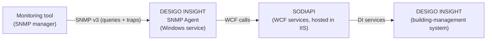

# DESIGO INSIGHT SNMP Agent — A Plain-English Guide

*A friendly, no-jargon explanation of what the DESIGO INSIGHT SNMP Agent is, why it
exists, and how it lets ordinary network-monitoring tools "see" the alarms and logs
coming out of a Siemens building-management system.*

This guide is written for a **non-technical reader**. You do not need to know networking,
building automation, or programming. Every technical term is explained the first time it
appears. If you only read one document about this project, read this one.

> **Provenance.** This README summarises the design concept described in the Ascentiv AG
> document *"Concept — DESIGO INSIGHT SNMP Agent"*, version 0.3 (25 November 2010, author
> Claudio Imoberdorf). It describes an **intended design**, not shipped product
> documentation.

---

## Table of contents

1. [The 30-second version](#the-30-second-version)
2. [First, what is SNMP (and a MIB, and an "agent")?](#first-what-is-snmp-and-a-mib-and-an-agent)
3. [What problem does this solve?](#what-problem-does-this-solve)
4. [How it all fits together](#how-it-all-fits-together)
5. [What the agent exposes — the MIB](#what-the-agent-exposes--the-mib)
6. [Alarms, in plain language](#alarms-in-plain-language)
7. [Logs, in plain language](#logs-in-plain-language)
8. [Health, security, and reliability](#health-security-and-reliability)
9. [What you need to run it](#what-you-need-to-run-it)
10. [Mini-glossary](#mini-glossary)
11. [Status and limitations](#status-and-limitations)

---

## The 30-second version

A large building is run by a **building-management system (BMS)** — here, Siemens
**DESIGO INSIGHT** — which watches thousands of points (temperatures, fans, doors, pumps)
and raises **alarms** and keeps **logs** when something happens.

Big organisations already run **network-monitoring tools** (the same kind that watch
servers, routers, and printers) in a central operations room. Those tools speak a common
language called **SNMP**.

The **DESIGO INSIGHT SNMP Agent** is a small piece of software that acts as a
**translator**: it takes the building system's alarms and logs and presents them in SNMP,
so the central monitoring room can watch the building **alongside everything else**, and
get an automatic alert the moment an alarm changes — without anyone logging into the
building system.

---

## First, what is SNMP (and a MIB, and an "agent")?

Three terms unlock everything else. Here they are in everyday language.

- **SNMP (Simple Network Management Protocol)** — a *common language* that monitoring
  tools use to ask devices "how are you doing?" and to receive "something just happened!"
  messages. If you've ever seen a dashboard that shows every server and switch in a
  company as a green or red dot, SNMP is usually what feeds it.

- **Agent** — the piece of software *on the thing being watched* that answers those SNMP
  questions. A printer has an SNMP agent; a server has one. This project is an SNMP agent
  **for a building-management system**. Think of it as a **receptionist** who speaks SNMP
  on behalf of DESIGO INSIGHT.

- **MIB (Management Information Base)** — the *menu* of everything you're allowed to ask
  the agent, written in a standard, hierarchical form. When a monitoring tool wants to
  know "how many high-priority alarms are active?", the MIB is what tells it that such a
  question exists and where to find the answer.

- **Trap** — an SNMP **push notification**. Instead of the monitoring tool constantly
  asking "anything new? anything new?", the agent **phones home** the instant something
  changes. Traps are how you get an alert in seconds rather than minutes.

So, in one sentence: *this project is a receptionist (agent) that publishes a menu (MIB)
of a building system's alarms and logs in a common language (SNMP), and rings a bell
(trap) when something changes.*

---

## What problem does this solve?

DESIGO INSIGHT has its own screens and its own way of showing alarms and logs. That's
fine if someone is sitting in front of it — but large sites want **one** central place
that watches **everything**: IT systems, network gear, *and* the building.

Without this agent, the building system is an island: to see its alarms you must open its
own software. With this agent:

- the building's **live alarms** show up in the same monitoring dashboard as everything
  else;
- the operations room gets an **automatic alert** (a trap) the moment an alarm appears or
  clears, or when the overall alarm counts change;
- the building's **log history** can be queried through the same standard tooling;
- the monitoring room can even check **"is the building link healthy?"** with a single
  standard query.

In short, it turns a specialist building system into just another well-behaved device on
the corporate monitoring map.

---

## How it all fits together

The agent doesn't talk to DESIGO INSIGHT directly. It goes through a documented service
layer called **SODIAPI** (the *Service-Oriented DESIGO INSIGHT API*), which is the
supported, service-style doorway into DESIGO INSIGHT.

A few key facts about this arrangement:

- The SNMP Agent runs as a **Windows service** set to start **automatically**, so it's
  available as soon as the machine boots.
- It reaches the building system through **SODIAPI**, which is hosted in Microsoft **IIS**
  (a web server built into Windows) and built on the **.NET** platform using **WCF** (a
  .NET technology for programs to talk to each other).
- The three pieces — **SNMP Agent**, **SODIAPI**, and **DESIGO INSIGHT** — can live on
  three separate computers **or all on one**; the design doesn't force a layout.
- There is a strict **one-to-one** relationship: **one agent ↔ one SODIAPI endpoint ↔ one
  DESIGO INSIGHT project**. To cover several building projects, you run several agents
  side by side, each wired to its own project.
- If SODIAPI isn't reachable when the agent starts, the agent keeps **retrying** on its
  own until the connection comes up.

---

## What the agent exposes — the MIB

Everything the agent publishes lives under one address in the global SNMP tree, the
Siemens **DESIGO INSIGHT** MIB module (its identifier, or **OID**, is
`1.3.6.1.4.1.6361.8.1.1` — `6361` is Siemens Building Technologies' registered number).

The menu is organised into **three groups**:

| Group | What it's for |
|---|---|
| **`agentSupervision`** | A quick health check of the agent itself (see [Health](#health-security-and-reliability)). |
| **`alarms`** | Everything about the building's current alarms (see [Alarms](#alarms-in-plain-language)). |
| **`logs`** | Access to the building system's log entries (see [Logs](#logs-in-plain-language)). |

---

## Alarms, in plain language

This is the heart of the agent. It offers three complementary ways to know about alarms.

**1. The full list — `alarmTable`.** A monitoring tool can read a table of every building
point that is currently in an alarm state, with details for each one (its system id,
description, and so on). To keep this manageable you can **filter** what appears (below).

**2. The scoreboard — `alarmSummary`.** Rather than the full list, you can just ask for
the **counts**: how many **high**, **medium**, and **low** priority alarms are active
right now. (The scoreboard always reflects *all* alarms — the filter does not change these
totals.)

**3. The doorbells — traps (push alerts).** Two kinds of automatic notification:

- **`alarmSummaryTrap`** fires whenever the scoreboard changes, carrying the new high /
  medium / low counts.
- **`alarmDetailTrap`** fires for **each individual** alarm change on a single point,
  carrying that point's full details. When the agent starts up, it sends one of these for
  every point already in alarm (so a restart can produce a burst of catch-up notices).

### Filtering which alarms you see

Because a big site can have a lot of alarms, the agent reads an **XML configuration file**
that lets you narrow the `alarmTable` (and the detail traps) by any mix of:

- **System ids** — restrict to specific points (or whole sites/devices via partial ids);
- **Alarm states** — restrict to specific states;
- **Alarm conditions** — restrict to specific conditions.

Multiple values of the *same* kind are combined with **OR**; different kinds are combined
with **AND** — e.g. *(this point OR that point) AND (this condition OR that condition)*.

---

## Logs, in plain language

The agent also exposes the building system's **log entries** through a `logTable`.

- Because the log database can be huge, you **must** filter it (see below), and in any
  case the agent **caps the table at 1000 entries** to protect performance.
- A companion value, **`logTableOverflow`**, is set to **1** if your filter still matched
  more than 1000 entries (so the list was trimmed), or **0** if everything fit.
- A **`logTrap`** fires when new entries appear. The agent finds new entries by **polling**
  SODIAPI on a schedule you configure (the interval is in seconds, with a **60-second
  minimum**).

### Filtering which log entries you see

As with alarms, an XML filter narrows the `logTable` by:

- **Event group** — restrict to specific groups of events;
- **Event number** — restrict to specific event types.

Again: same-kind values are **OR**-ed, different kinds are **AND**-ed. The guidance is to
make this filter **highly selective**, precisely because of the 1000-entry ceiling.

---

## Health, security, and reliability

- **Is the link healthy? — `sodiapiStatus`.** A single value the monitoring room can read
  to check the agent's health:

  | Value | Meaning |
  |---|---|
  | **OK** | The agent is running fine. |
  | **No SODIAPI** | The agent can't reach the SODIAPI service. |
  | **No DI** | SODIAPI is reachable, but *it* can't reach DESIGO INSIGHT. |

  When something's wrong, the detailed reason is in the agent's own log messages.

- **Security — SNMP v3 with authentication.** The agent uses **SNMP version 3** and
  **requires clients to authenticate**; anonymous access is not allowed. (Message
  *privacy/encryption* is not part of this design.)

- **Always-on startup.** Running as an automatic Windows service, it comes up with the
  machine and reconnects to SODIAPI by itself if the connection drops.

- **Its own logging — Log4Net.** The agent writes detailed diagnostics using **Log4Net**,
  a flexible logging library. A config file decides *what* is logged and *where* it goes
  (rolling files, the Windows event log, and so on). Deployment is just including the
  `log4net.dll` file.

- **Performance.** The number of log-table entries is the performance-critical factor,
  which is why the selective filter and the hard 1000-entry cap both exist.

- **Recovery.** If the agent fails unexpectedly, its hosting Windows service can simply be
  restarted from the Windows Services panel.

---

## What you need to run it

**Software prerequisites (from the concept):**

- Windows Server 2008 or later
- .NET Framework 4.0
- SODIAPI V2.0
- DESIGO INSIGHT V4.1

**Other practicalities:**

- **Installation is manual** — both the SNMP Agent and SODIAPI are installed by hand,
  following their respective guides.
- **Configuration is via files** — the agent's alarm/log filters and behaviour come from
  an XML config file; Log4Net has its own config file.
- **No licence protection in the agent itself**, though the **SODIAPI** layer it relies on
  is a licensed DESIGO INSIGHT feature.
- **English only** — the agent carries no text needing translation; any localised text
  comes from DESIGO INSIGHT itself.

---

## Mini-glossary

| Term | Plain meaning |
|---|---|
| **SNMP** | A common language monitoring tools use to query devices and receive alerts. |
| **SNMP v3** | The modern SNMP version this agent uses; supports authenticating clients. |
| **Agent** | Software on the watched system that answers SNMP questions — here, for DESIGO INSIGHT. |
| **MIB** | The catalogue of everything an SNMP agent can be asked, in a standard tree form. |
| **OID** | The numeric "address" of an item within that tree (e.g. `1.3.6.1.4.1.6361.8.1.1`). |
| **Trap** | An SNMP push alert the agent sends the moment something changes. |
| **DESIGO INSIGHT** | Siemens' building-management system that this agent exposes. |
| **BMS** | Building-management system — the software running a building's equipment. |
| **SODIAPI** | Service-Oriented DESIGO INSIGHT API — the service doorway the agent uses to reach DESIGO INSIGHT. |
| **WCF** | A .NET technology for programs to talk to each other over a network. |
| **IIS** | Internet Information Services — the web server built into Windows that hosts SODIAPI. |
| **.NET** | Microsoft's software platform the agent and SODIAPI are built on. |
| **Log4Net** | A flexible logging library the agent uses for its own diagnostics. |
| **Data point** | A single monitored thing in the building (a sensor, valve, fan, etc.). |
| **Alarm state / condition** | The specific status of a data point used to describe and filter alarms. |
| **Windows service** | A background program that runs without a user logged in and can start automatically. |

---

## Status and limitations

- This describes a **design concept (v0.3, 2010)**, not a finished product. Details such
  as exact MIB fields and version numbers reflect that document and may differ from any
  later implementation.
- The design deliberately **omits message privacy/encryption** (it authenticates clients
  but does not encrypt SNMP traffic).
- The **log table is capped at 1000 entries**; a selective filter is essential.
- Everything depends on the **SODIAPI ↔ DESIGO INSIGHT** chain being healthy — the
  `sodiapiStatus` value is the first thing to check when data looks wrong.

---

*This document explains the concept in everyday terms. For exact object definitions, the
full MIB, alarm-state tables, and event-number lists, see the original Ascentiv concept
document.*
